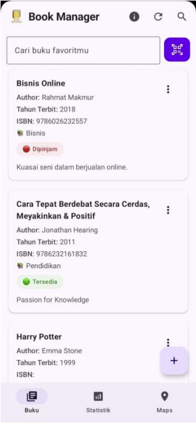
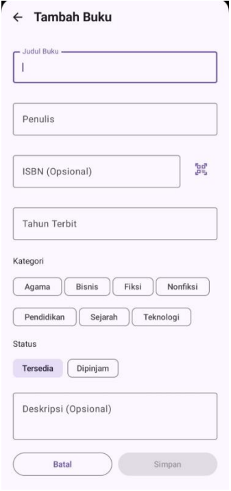
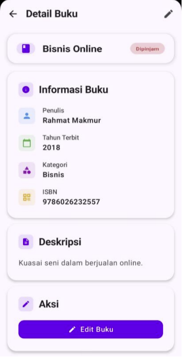
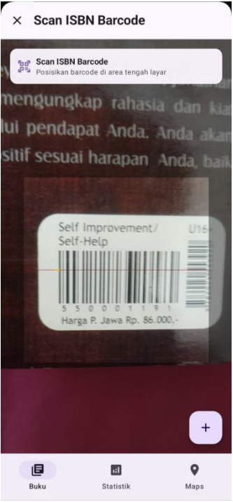
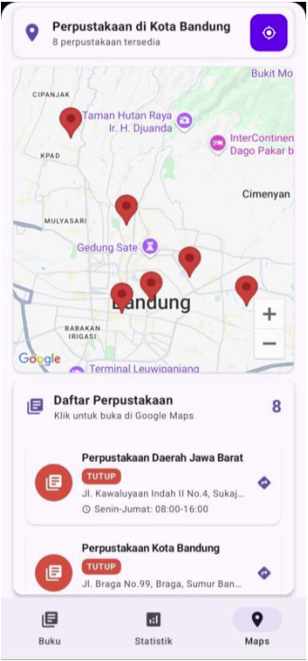
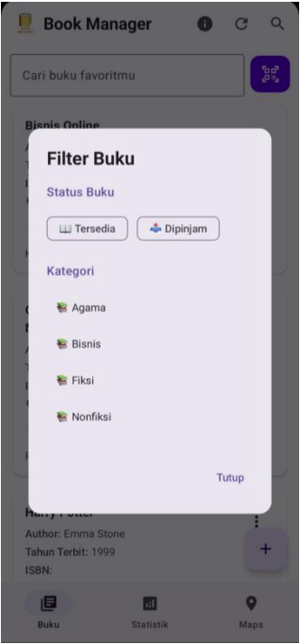
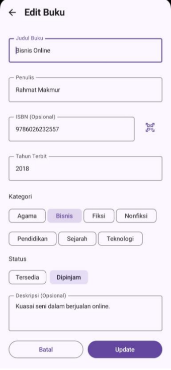
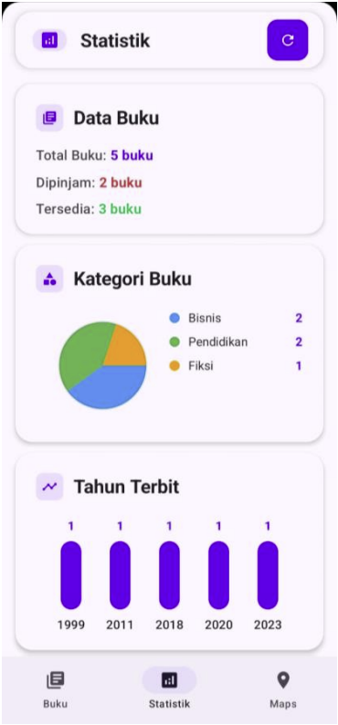

# 📚 Book Manager

**Book Manager** is a mobile application built using Android (Jetpack Compose) to help users manage their book collections efficiently. Developed as a final project for *Mobile Programming 1* at Universitas Teknologi Bandung, this app supports local data management, QR code scanning, and location-based library search.

## 🔧 Features

- 🔄 **Fragment-based Navigation**
- 📖 **Book Catalog** with full CRUD (Create, Read, Update, Delete)
- 📊 **Statistics Dashboard** for data visualization
- 📷 **QR Code ISBN Scanner** using ZXing library
- 🗺️ **Google Maps Integration** to find nearby libraries
- 💾 **SQLite Local Storage**
- ✨ **Modern UI with Jetpack Compose & MVVM Architecture**

## 🖼️ Screenshots

| Main Screen | Add Book | Book Details | QR Code Scanner |
|-------------|----------|---------------|------------------|
|  |  |  |  |

| Maps View | Book List | Edit Book | Statistics |
|-----------|-----------|-----------|------------|
|  |  |  |  |

## 📁 Project Structure

BookManager/
├── data/
│ └── database/ # SQLite helper and DAO
├── model/ # Book data models
├── ui/
│ ├── screens/ # Compose screens (Main, Add/Edit, List, Stats, Maps)
│ └── components/ # Reusable UI components
├── viewmodel/ # BookViewModel (MVVM pattern)
├── utils/ # QR Code & helper functions
└── screenshots/ # App screenshots (for README)

markdown
Copy
Edit

## 🧰 Tech Stack

- **Language**: Kotlin  
- **UI**: Jetpack Compose  
- **Database**: SQLite  
- **QR Scanner**: ZXing Android Embedded  
- **Maps**: Google Maps SDK  
- **Architecture**: MVVM  

## 🚀 Getting Started

### Prerequisites

- Android Studio Hedgehog (or newer)
- Android SDK 24+
- Internet access for Google Maps API

### Installation

```bash
git clone https://github.com/yourusername/BookManager.git
Open the project in Android Studio

Let Gradle sync and resolve dependencies

Run the app on emulator or physical device

🔐 Demo Credentials
makefile
Copy
Edit
Username: admin  
Password: admin123
📚 Learning Outcomes
Applied Fragment navigation using FragmentManager

Displayed dynamic lists using RecyclerView (LazyColumn)

Built a complete SQLite integration for local storage

Integrated QR Code Scanner for ISBN input

Used Google Maps API with real-time markers and interaction

🙏 Acknowledgments
🧑‍🏫 Rudhi Wahyudi Febrianto, S.Kom., M.Kom. – Lecturer & project supervisor

ZXing Team for the QR scanner library

Android & Google documentation

Inspired by real-world book tracking challenges

📄 License
This project is licensed under the MIT License. See LICENSE.md for more details.

📫 Contact
Muhammad Martio Al Anshori
📧 martioalanshori@gmail.com
🔗 LinkedIn
